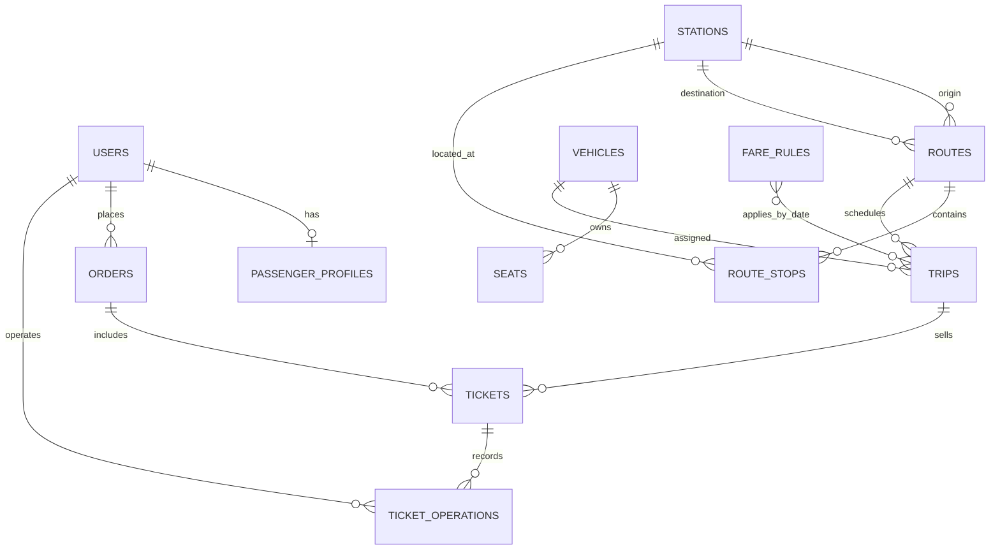

# 设计报告正文提纲

## 一、题目
汽车客运站售票管理系统

## 二、需求分析
- 数据需求：用户、旅客档案、站点、线路、经停点、车辆、座位、班次、票价规则、订单、车票、票务操作记录。
- 数据处理：登录认证、班次查询、预售购票、退票、换票、后台维护、销售统计。
- 数据存储：使用 MySQL 8.x，InnoDB 保证事务，外键保证参照完整性。

## 三、数据分析与建模

## 四、数据库建立
- 概念设计：以线路和班次为中心，车辆座位决定余票，订单和车票记录售票结果。
- 逻辑设计：核心表见 `sql/mysql_schema.sql`。
- 物理设计：常用查询字段建立索引，如班次发车时间、线路发车时间、车票班次状态、订单用户状态。

## 五、数据库应用开发与运行
- 前端：Vue 3 页面包括旅客购票、窗口业务、系统管理。
- 后端：Flask REST API，统一错误响应，session 登录。
- 关键事务：购票锁定班次并分配座位；退票更新车票状态并释放座位；换票将旧票置为换出并创建新票。
- 调试结果：`pytest -q` 后端测试通过，`npm run build` 前端构建通过。

## 六、结果分析与心得体会
本系统覆盖车站售票管理的核心流程。数据库设计中，座位、班次和车票之间的关系是防止超售的关键；票价规则通过日期范围和优先级实现节假日浮动。实现过程中，事务控制和权限控制是保证系统正确性的重点。
